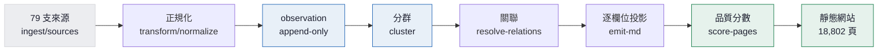

# seh.tw

> Google Maps 告訴你這裡**有什麼**，seh 告訴你這裡**正在發生什麼**。

台灣文化活動的地圖、行事曆與搜尋。79 支公開資料來源，71,926 筆原始記錄，
每小時自動更新，全靜態產出，沒有資料庫。

## 這是什麼

政府與各館所公布的藝文活動散在幾十個入口，格式不一、同一場活動被登錄好幾次、
場地名稱對不起來。seh 把它們接起來：抓取 → 正規化 → 分群去重 → 建立關聯 →
逐欄位挑最佳值 → 判斷夠不夠格被搜尋引擎收錄 → 產生靜態網站。



三個設計上的決定，其餘都是它們的推論：

- **合併是可逆的**。分群不是把兩筆資料併掉，是記下「這幾筆指同一件事」。
  判錯了改 `overrides/merge-block.json` 就拆得回來，原始資料一直都在。
- **網址是永久的**。`data/slug-registry.ndjson` 只增不改。活動改了名字，
  頁面標題跟著改，網址不動。
- **建網址和被收錄是兩件事**。所有 entity 一律建頁；夠不夠格請搜尋引擎收錄
  每天重算。活動結束就退出收錄，網址留著。

## 現況

| | 網址 | 送進 sitemap |
|---|---|---|
| 活動 | 5,666 | 1,814 |
| 場館 | 10,461 | 271 |
| 文化資產 | 2,469 | 1,987 |
| 全站 | 18,802 頁 | 4,273 |

收錄比例低是設計如此，不是還沒做完——多數活動已經結束，多數場館是沒有活動的
名錄 POI。逐項說明在 [`docs/pages-status.md`](docs/pages-status.md)，
資料流程的實算數字在 [`/about`](https://seh.tw/about)。

## 指令

```
npm run dev        本機開發
npm run pipeline   跑完整條：正規化 → 健康檢查 → 分群 → 關聯 → 產出 → 品質分 → 建置
npm run ingest     依排程抓取到期的來源（不到期的不抓）
npm test           251 條測試
npm run review     人工待辦佇列
npm run sources    重新產生 SOURCES.md
npm run links      檢查站內連結（build 之後跑）
```

單獨重抓一支來源：`node ingest/sources/<id>.mjs`
只跑某一段：`npm run pipeline -- --from cluster --no-build`

## 文件

| | |
|---|---|
| [`transform/ARCHITECTURE.md`](transform/ARCHITECTURE.md) | 分群、逐欄位品質分、關聯與懸空邊 |
| [`transform/STORAGE.md`](transform/STORAGE.md) | 全檔案儲存，無資料庫 |
| [`transform/L1-FORMAT.md`](transform/L1-FORMAT.md) | 正規化產出格式 |
| [`ingest/CONTRACT.md`](ingest/CONTRACT.md) | 取得層規格，79 支 script 照它寫 |
| [`ingest/SCHEMA.md`](ingest/SCHEMA.md) | 來源盤點與欄位覆蓋率 |
| [`ingest/probe/`](ingest/probe/) | 來源探測報告，含票務平台合法性判定 |
| [`docs/scheduling.md`](docs/scheduling.md) | 自適應重抓排程：改得勤的抓得勤 |
| [`docs/pages-status.md`](docs/pages-status.md) | 每種頁面的完成狀況 |
| [`SOURCES.md`](SOURCES.md) | 79 支來源與各自的授權 |
| [`docs/analytics.md`](docs/analytics.md) | Search Console 與 GA4 的設定與判讀 |
| [`docs/search-console-api.md`](docs/search-console-api.md) | 服務帳號申請六步，與 `scripts/gsc-pull.mjs` |

## 授權

程式碼 MIT（[`LICENSE`](LICENSE)）。資料不是——原始資料仍屬各來源機關，
seh 產生的部分是 CC BY 4.0，條件與必要的標示方式寫在
[`LICENSE-DATA.md`](LICENSE-DATA.md)。裡面也說明了哪些個資不會出現在這個 repo，
以及 4 支來源存在的授權矛盾。
