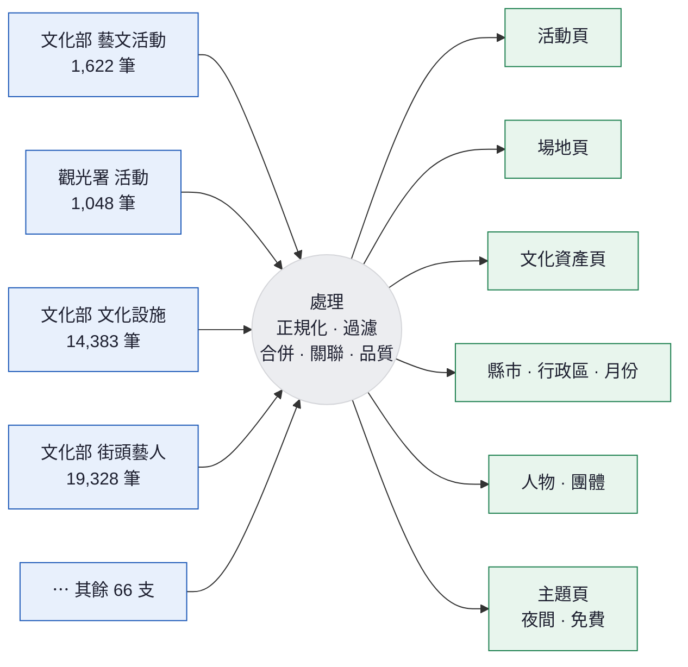

# `/about` 資料流視覺化 — 實作規格

2026-09-10。這份是給 Astro 實作階段照著做的規格，不是設計提案。

---

## 1. 這個頁面要回答什麼

「seh 的資料從哪來、怎麼變成你看到的頁面。」

給三種讀者看：一般使用者（想知道資料可不可信）、資料提供方（政府機關、場館，想知道自己的資料被怎麼用）、潛在合作對象。

**不是**技術架構圖。不要出現 cluster、projection、NDJSON 這類內部詞彙。畫面上的用詞一律用一般人看得懂的說法。

---

## 2. 時間範圍與真實性

**呈現的是近 24 小時的抓取活動。**

排程是自適應的、依各來源實際變動頻率分散執行（見 `scheduling.md`），所以 24 小時內本來就持續有來源在被抓取——不是凌晨一次全部抓完。動畫的持續流動忠實反映這件事，不需要免責聲明。

要求：

- 左欄每個來源顯示的筆數、最後抓取時間，以及右欄每個分類的頁數，**必須是真實數字**，不為視覺效果調整。
- 近 24 小時內沒被抓取的來源（間隔還沒到）仍然顯示在左欄，但呈現為靜止狀態，並顯示「下次預計抓取」時間。這是真實的排程狀況，不是異常。
- 抓取失敗的來源要明確顯示失敗，不可假裝正常。
- 「官方宣告更新頻率」與「實測變動頻率」的對照本身就是有價值的資訊，值得顯示——例如某來源宣告每日更新但實測 9 個月沒動。

---

## 3. 版面結構

**一個來源流過中間，在右邊分岔成多個結果。** 不是「全部匯流成一條再分流」——那會看不出哪個來源貢獻了什麼。



### 一對多是這個頁面的重點

一支來源不是只餵給一種頁面。實際對應：

| 來源類型 | 支數 | 產出的頁面種類 |
|---|---|---|
| 活動 | 24 | 活動頁 **＋ 場地頁**（場館名對不上名錄時自動建立）**＋ 縣市／行政區／月份頁 ＋ 主題頁 ＋ 演出者** |
| 場地 | 23 | 場地頁 ＋ 縣市頁 |
| 文化資產 | 4 | 文化資產頁 ＋ 縣市頁 |
| 人物 | 10 | 人物頁 |
| 團體 | 9 | 團體頁 |

活動來源會產出五種頁面，這是最值得展示的一條——**文化部那 1,622 筆活動，同時生出了活動頁、場地頁、縣市頁、月份頁和演出者**。

### 核心互動

**hover 或聚焦左欄任一來源時，highlight 它流向哪些產出**，其餘線條淡化，並顯示「這個來源貢獻了 N 個活動頁、M 個場地頁…」。反向也要成立：hover 右欄任一產出，highlight 哪些來源餵養了它。

這個互動就是整個頁面存在的理由——回答「我提供的資料變成了什麼」。

桌機三欄並排。窄螢幕（< 900px）改為上中下三段直排，動畫方向由左→右改為上→下，一對多的分岔改在下方展開。

---

## 4. 左欄：70 個來源

### 呈現

每個來源一個節點，依 `kind` 分成五組垂直排列（event / venue / person / organization / heritage）。組與組之間有標題與間距。

節點顯示：來源中文名稱（不是程式 id）、筆數。節點大小依筆數取對數縮放（`d3.scaleLog`），避免 `moc-buskers` 19,328 筆把 `ncl-events` 10 筆壓成看不見。

hover 顯示：來源全名、提供機關、授權條款、最後成功抓取時間、筆數。

### 狀態

| 狀態 | 條件 | 視覺 |
|---|---|---|
| 近 24 小時有抓，內容有變 | 抓取成功且 `contentHash` 改變 | 正常色，持續發出粒子 |
| 近 24 小時有抓，內容沒變 | 抓取成功但內容相同 | 正常色，偶爾發出粒子（頻率明顯較低） |
| 等待中 | 重抓間隔還沒到 | 靜止，顯示「下次預計抓取」時間 |
| 異常 | 筆數掉超過 30% | 警告色，粒子變稀疏 |
| 失敗 | 連續 3 次抓取失敗 | 錯誤色，不發粒子，節點加上停用標記 |

「等待中」是正常狀態不是問題——排程依各來源實際變動頻率自適應（6 小時到 30 天不等，活動類最長 7 天），一支一年才更新一次的名錄本來就不該天天被抓。hover 時要能看到「官方宣告 vs 實測變動頻率」的對照。

### 資料檔

`public/pipeline-stats.json`，build 時由 `transform/emit-pipeline-stats.mjs` 產生。格式見 §8。

---

## 5. 中欄：五個處理階段

每個階段是一個「閘門」，粒子通過時會有一部分被篩掉，落下或淡出。**篩掉的比例必須對應真實數字**。

粒子帶著來源身分——從哪個來源出發的粒子，在右邊要能追蹤到它進了哪些產出。這是 §3 那個核心互動的基礎。

| 階段 | 一般人看得懂的說明 | 實際做的事 | 真實比例 |
|---|---|---|---|
| 正規化 | 「把 70 種格式統一成一種」 | normalize | 不篩，全通過 |
| 過濾 | 「去掉已經結束的、資料不足的」 | 日期過濾 | 活動 5,939 → 未結束約 4,508 |
| 合併重複 | 「同一個活動可能有好幾個來源同時提供」 | 去重 | 4,508 → 3,332 個不重複活動 |
| 建立關聯 | 「把活動連到場地、場地連到縣市」 | relation | 場地連通 99.8%，演出者 16.7% |
| 品質判定 | 「內容夠不夠成為一個頁面」 | quality score | 3,332 → 可收錄約 2,858 頁 |

每個階段旁邊顯示「進 N 筆 → 出 M 筆」的真實數字。

**「合併重複」這一階段是全站最值得展示的東西**——它是 seh 相對於其他平台的核心差異。這一階段的粒子動畫應該做成「多個粒子匯聚成一個」，而不是單純篩掉。可以搭配一個真實例子的說明文字：

> 《東西古今．四方遊藝》這場音樂會同時出現在文化部、臺中國家歌劇院、臺北文化快遞三個來源。
> 文化部給了完整的三場場次與座標，臺北文化快遞給了活動介紹與票價，臺中國家歌劇院給了另一個票價寫法。
> seh 把它們合併成一筆，每個欄位各取最完整的來源。

### 「建立關聯」階段的懸空邊

有一部分粒子在這一階段會**連不上**（例如場地名稱對不到任何已知場地）。這些不應該消失——視覺上讓它們停在階段之間、顏色轉為未解析狀態，並顯示計數。這是誠實呈現資料現況，也順帶說明了為什麼有些頁面內容較少。

---

## 6. 右欄：產出的頁面

五類，顯示真實頁數與「可被搜尋引擎收錄」的頁數：

| 分類 | 建立網址 | 目前可收錄 |
|---|---|---|
| 活動 | 3,332 | 2,572 |
| 場地 | 2,376 | 約 500 |
| 文化資產 | 6,412 | 2,014 |
| 縣市 · 行政區 · 月份 | 537 | 199 |
| 主題（夜間 · 免費） | 30 | 18 |

每一類可點擊，連到該分類的列表頁。hover 時反向 highlight 是哪些來源餵養了它。

**「場地」這一類要特別標示一件事**：2,376 個場地裡有相當比例不是來自任何場館名錄，而是**從活動資料自動建立的**——活動說「這場在國家音樂廳」，而國家音樂廳不在政府開放資料裡，系統就依活動附帶的地址與座標把它建起來。這是「一個來源產出多種結果」最具體的例子，值得在頁面上用一兩句話說明。

「建立網址」與「可收錄」的差距要有一句說明：**「所有資料都有自己的網址，但只有內容足夠的頁面才會請搜尋引擎收錄。哪些頁面夠格是每天重新判定的——一個場地今天沒有活動，明天有了，它就會自動被收錄。」**

---

## 7. 技術實作

### 用什麼

```
d3-scale     節點大小、顏色映射
d3-shape     連線路徑（curveBumpX）
d3-selection 
d3-timer     動畫主迴圈（不要用 setInterval）
```

**不要用 `d3-force`。** 版面是固定的三欄流程圖，節點位置應該由程式算好，不需要力導向模擬——那會讓每次載入的版面都不一樣，也吃 CPU。

只 import 需要的模組，不要整包 `d3`。

### 粒子動畫

用單一 `<canvas>` 畫粒子，**不要用 SVG 元素畫每個粒子**。同時在畫面上的粒子數量上限 300，超過就不再產生新的。節點與連線用 SVG（需要 hover 與無障礙），粒子用 canvas 疊在上層。

主迴圈用 `d3.timer`，每個粒子沿預先算好的路徑（`getPointAtLength`）前進。路徑長度在版面計算時算一次存起來，不要每幀算。

### 效能要求

- 首次可互動時間不因這個頁面而超過 2 秒
- 動畫穩定 60fps；量測方式是 Chrome DevTools Performance 錄 10 秒，掉幀不超過 5%
- 頁面離開視窗（`document.hidden`）時暫停動畫
- 用 `IntersectionObserver`，動畫區塊捲出畫面時暫停

### 降級

| 情況 | 行為 |
|---|---|
| `prefers-reduced-motion: reduce` | 不播粒子動畫，顯示靜態的完整流程圖（所有連線與數字都在） |
| JavaScript 未載入 | 顯示靜態流程圖（SVG 直接寫在 HTML 裡，不靠 JS 產生） |
| 窄螢幕 | 三欄改直排，粒子方向改為由上往下 |

**靜態版本必須自己就是完整的。** 這頁面在搜尋引擎眼中、在 JS 失敗時，都要能傳達同樣的資訊。動畫是加分不是必要。

---

## 8. 資料檔格式

`public/pipeline-stats.json`，build 時由 `transform/emit-pipeline-stats.mjs` 產生，資料來自 `data/schedule-state.json` 與抓取記錄。

```jsonc
{
  "generatedAt": "2026-09-10T14:00:00+08:00",
  "window": "24h",

  "sources": [
    {
      "id": "moc-events",
      "name": "文化部 藝文活動",
      "org": "文化部",
      "kind": "event",
      "records": 1622,
      "license": "政府資料開放授權條款－第1版",
      "declaredFreq": "每 1 日",          // 官方宣告
      "observedInterval": "18h",          // 實測收斂到的間隔
      "lastFetchedAt": "2026-09-10T12:00:00+08:00",
      "lastChangedAt": "2026-09-10T12:00:00+08:00",
      "nextDueAt": "2026-09-11T06:00:00+08:00",
      "status": "changed",                // changed|unchanged|waiting|degraded|failed
      "producesUrls": {                   // 一對多：這個來源貢獻了哪些頁面
        "events": 1487, "venues": 260, "cities": 22, "months": 98, "performers": 558
      }
    }
  ],

  "stages": [
    { "id": "normalize", "label": "正規化",   "in": 71551, "out": 71551 },
    { "id": "filter",    "label": "過濾",     "in": 5939,  "out": 4508 },
    { "id": "dedupe",    "label": "合併重複", "in": 4508,  "out": 3332 },
    { "id": "relate",    "label": "建立關聯", "in": 3332,  "out": 3332,
      "unresolved": { "venue": 1, "performer": 2774 } },
    { "id": "quality",   "label": "品質判定", "in": 3332,  "out": 2572 }
  ],

  "outputs": [
    { "id": "events",   "label": "活動",           "urls": 3332, "indexable": 2572, "href": "/events",
      "fedBy": ["moc-events", "twtourism-events", "taipei-culture-events"] },
    { "id": "venues",   "label": "場地",           "urls": 2376, "indexable": 500,  "href": "/venues",
      "derivedFromEvents": 260 },
    { "id": "heritage", "label": "文化資產",       "urls": 6412, "indexable": 2014, "href": "/heritage" },
    { "id": "places",   "label": "縣市 · 行政區 · 月份", "urls": 537, "indexable": 199 },
    { "id": "people",   "label": "人物 · 團體",     "urls": 31031, "indexable": 140 },
    { "id": "topics",   "label": "主題",           "urls": 30,   "indexable": 18 }
  ],

  "activity": [                          // 近 24 小時的抓取事件，供時間軸與動畫節奏用
    { "at": "2026-09-10T12:00:00+08:00", "sourceId": "moc-events", "result": "changed", "records": 1622 }
  ]
}
```

`docs/about-sources.json` 是目前 70 支來源的清單快照（含 `updateFreq` 宣告值），開發時可作為假資料。

`activity` 陣列是動畫節奏的依據——**粒子的產生時機對應真實的抓取事件**，不是均勻亂灑。近 24 小時抓了 12 次就是 12 波，這樣動畫本身也在傳達「排程是分散的」這件事。

---

## 9. 樣式

**token 一律取自統一設計系統**（`src/styles/tokens.css`，由 `npm run sync:tokens` 從 design-tokens 規範同步）。這個頁面不得定義任何新的顏色或字級。

```
--bg-base --bg-surface --bg-overlay --bg-hover     背景
--text-primary --text-secondary --text-muted        文字
--border-subtle                                     線
--color-link                                        來源節點、連線、強調
--color-pass                                        通過的粒子、可收錄的產出
--color-warn                                        異常來源、懸空的邊
--color-fail                                        失敗來源
--text-xs（18px）到 --text-3xl（56px）              字級，最小 18px 無例外
```

canvas 裡的粒子顏色不能寫死——用 `getComputedStyle(document.documentElement).getPropertyValue('--color-pass')` 讀取 token。`oklch()` 值 canvas 2D 可直接接受（`ctx.fillStyle`），舊瀏覽器由 tokens.css 的 `@supports not` fallback 供給 hex。

Mermaid 只支援 hex，用 design-tokens `colors.md` 的 Hex 欄，不要寫 `oklch()`。

## 10. 無障礙

- SVG 加 `role="img"` 與 `aria-label`，內容是流程的文字摘要
- 每個來源節點可用 Tab 聚焦，聚焦時顯示與 hover 相同的資訊，並有可見的 focus ring
- 數字不只用顏色表達狀態，異常與失敗要有文字或圖示
- canvas 加 `aria-hidden="true"`（純裝飾，資訊都在 SVG 與文字裡）

---

## 11. 實作順序

1. `transform/emit-pipeline-stats.mjs` — 產生 `public/pipeline-stats.json`
2. `src/pages/about.astro` — 靜態版本（SVG 流程圖 ＋ 三欄數字 ＋ 說明文字），不含任何 JS
3. 確認靜態版本自己讀得通、SEO 拿得到完整資訊
4. 加上 canvas 粒子動畫層
5. 加上 hover / focus 互動
6. 加降級處理（reduced-motion、hidden、IntersectionObserver）
7. 深色模式取色驗證

第 2 步做完就該是一個可以上線的頁面。動畫是第 4 步之後的加分項。
