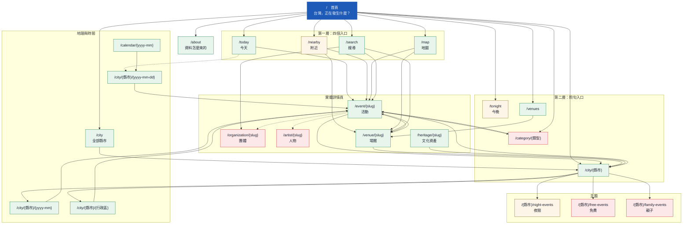

# seh.tw 網站地圖

2026-09-11。頁數為當日實測估算，正規化層完成後會變動。

---

## 全站結構



實線＝資料撐得起的連結；虛線＝關聯尚未接通。
綠＝現在做得出來｜黃＝資料有缺口但可做｜紅＝資料不足，先 noindex。

---

## 頁面清單

### 入口與功能頁

| 路徑 | 說明 | 頁數 | 狀態 |
|---|---|---|---|
| `/` | 首頁，雙層入口 | 1 | 已完成 |
| `/today` | 今天有什麼 | 1 | 可做 |
| `/tonight` | 今晚（19:00 後開始） | 1 | 可做，但只有 `granularity=datetime` 的場次算得進去 |
| `/nearby` | 附近，用瀏覽器定位 | 1 | 可做，座標覆蓋 88% |
| `/map` | 全台地圖 | 1 | 可做 |
| `/search` | 搜尋 | 1 | 可做，前端索引 110 KB |
| `/calendar/{yyyy-mm}` | 月曆 | 依月份 | 可做 |
| `/about` | 資料流視覺化 | 1 | 規格見 `about-page-spec.md` |

### 實體詳情頁

| 路徑 | 頁數 | 可收錄 | 狀態 |
|---|---|---|---|
| `/event/{slug}` | 3,532 | 3,532 | 可做 |
| `/venue/{slug}` | 2,376 ＋ derived | 約 500 | 可做，其餘無活動先 noindex |
| `/heritage/{slug}` | 6,412 | 2,014 | 可做，只有 2,014 筆有 200 字以上沿革 |
| `/organization/{slug}` | 5,054 | **99** | **先 noindex**，只有 99 個連得到活動 |
| `/artist/{slug}` | 25,977 | **41** | **先 noindex**，多為街頭藝人名冊，連不回活動 |

### 地理與時間

| 路徑 | 頁數 | 過門檻 | 狀態 |
|---|---|---|---|
| `/city` | 1 | 1 | 可做 |
| `/city/{縣市}` | 22 | 22 | 可做 |
| `/city/{縣市}/{yyyy-mm}` | 239 | 98 | 可做 |
| `/city/{縣市}/{行政區}` | 276 | 79 | 可做，宜蘭／新竹市／雲林／新竹縣一個都不過門檻 |
| `/city/{縣市}/{yyyy-mm-dd}` | 依日期 | — | 給搜尋引擎索引，`/today` 導向這裡 |

### 分類與主題

| 路徑 | 頁數 | 狀態 |
|---|---|---|
| `/category/{類型}` | 16 | **先 noindex**，文化部 category 1..20 官方對照未查到 |
| `/{縣市}/night-events` | 21（15 過門檻） | 可做 |
| `/{縣市}/free-events` | 9（3 過門檻） | 幾乎做不了，`isFree` 只有 3.7% 有值 |
| `/{縣市}/family-events` | — | **做不了**，親子類全台只有 8 場 |

### SEO 基礎

| 路徑 | 說明 |
|---|---|
| `/sitemap.xml` | 索引檔，分片為 events／venues／heritage／cities／calendar |
| `/robots.txt` | 只允許 `indexable = 1` 的頁面 |

---

## 目前的類型分布

分類頁能不能做，看的是這個：

```
節慶 989   音樂 598   展覽 398   戲劇 273   講座 241   電影 116
舞蹈  74   其他  36   課程  19   研習  19   表演  15   演唱會 11
親子   8   競賽   5   徵選   2   綜藝   1
```

前六類撐得起獨立頁面，後十類數量太少。而「節慶」989 這個第一名其實是觀光署那批地方活動被我全部歸成同一類的結果——**分類對照沒做好之前，`/category/` 整組不該上線**。

---

## 四件擋住的事

| 擋住什麼 | 原因 | 解法 |
|---|---|---|
| `/category/*` | 文化部 category 1..20 沒有官方中文對照，觀光署 EventClasses 同樣未查到 | 找到官方對照表，或人工建立並標記 `verified: false` |
| `/organization/*` `/artist/*` | 名錄與活動是兩個母體，只有 99／41 連得上 | 需要名稱正規化與人工比對，短期做不起來 |
| `/{縣市}/free-events` | `isFree` 只有 3.7% 有值，可靠來源只有台北的 `TicketType` | 從 `priceText` 自由文字推導，或等來源補欄位 |
| `/{縣市}/family-events` | 全台親子類只有 8 場 | 從標題／描述判斷，屬 NLP 工程 |

---

## 導覽關係中最弱的一環

`/venue/{slug}` 是整個站的樞紐——活動連到場館、場館連回活動、場館屬於城市。但目前 2,376 個場館裡**只有約 500 個有活動可顯示**，其餘打開來是空的。

這條邊會隨 `derived venue`（從活動資料自動建立場館）與座標分群而改善，詳見 `transform/ARCHITECTURE.md` §5。

---

## tw-counties.json 的縣市名

g0v 那份 GeoJSON 是 2014 縣市改制前的版本：桃園寫「桃園縣」，臺北／臺中／臺南／臺東
用的是「台」字。跟資料端的正規化名稱（`transform/normalize/_lib.mjs` 的 `CITIES`）
對不起來，五個縣市會配不到。

2026-09-13 已就地正規化並只保留 `name` 屬性。**重新下載這份檔案時要再跑一次**，
否則任何用縣市名關聯的功能都會在這五個縣市悄悄失效——地圖目前用經緯度畫點所以
看不出來，但那只是還沒踩到。
